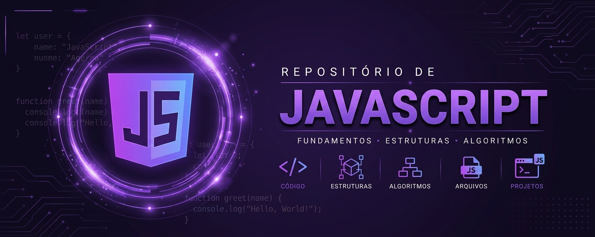

  

<h1 align="center">Repositório de Testes JavaScript</h1>

  <em>Lógica • Sintaxe • Prática</em>

  
  

Código:
Exercícios e testes práticos em JavaScript, focados em fixar sintaxe, lógica de programação e boas práticas.

Estruturas:
Testes com variáveis, funções, arrays, objetos e manipulação de dados.

Algoritmos:
Implementações de lógica própria para resolver pequenos desafios e exercícios de programação.

Arquivos:
Scripts organizados por tema/teste dentro deste repositório.

Projetos:
- **Projeto JSON (C + JS)** — Leitura e interpretação com Node.js de dados gerados em C e salvos em formato `.json`;

  📧 joaovitorperes06@gmail.com &nbsp;•&nbsp; 💻 <a href="https://github.com/Peressjj">github.com/Peressjj</a>

